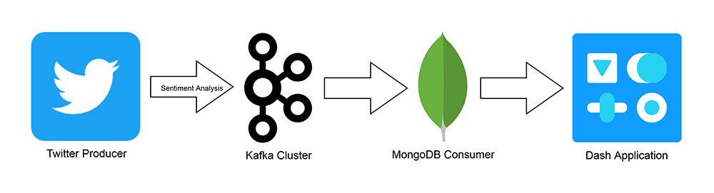

<h1 align="center">
  <br>
  <a href="https://trumpoji.com/"></a>
  <br>
  donald-track
  <br>
</h1>

<h4 align="center">A real-time sentiment analysis dashboard to track tweets about Donald Trump.</h4>

<p align="center">
  <a href="#about">About</a> •
  <a href="#pipeline">Pipeline</a> •
  <a href="#prerequisites">Prerequisites</a> •
  <a href="#installation">Installation</a> •
  <a href="#usage">Usage</a> •
  <a href="#license">License</a>
</p>


## About

This project is a prototype implementation of a real-time Twitter monitoring application that tracks public opinion towards specific topics — let's say about the former president Trump — by identifying sentiments fluctuation, analyzing related topics and geographic segmentation. It was created for the postgraduate course M151: Web Systems and Applications, at the Department of Informatics and Telecommunications within the University of Athens.

## Pipeline



The pipeline makes use of the [Twitter Streaming API](https://developer.twitter.com/en/docs/twitter-api/tweets/filtered-stream/introduction) in order to stream Trump-related tweets in Python using [Tweepy](https://www.tweepy.org/). The tweets are parsed and their text is analyzed on the fly using [TextBlob](https://textblob.readthedocs.io/en/dev/) before they are pushed into a topic in the `Kafka Cluster` by the aforementioned `Twitter Producer`.

On the other end, a `MongoDB Consumer` consumes the streaming data and stores them in a MongoDB collection. MongoDB is ideal for saving tweets and processing them later.

Finally, simple statistics on sentiment, hottest related topics and user locations are presented in a real-time interactive `Dash Application`.

## Prerequisites

To work with the Twitter Streaming API, you first need the required API keys. More specifically, you need your personal consumer key, consumer secret, access token and access token secret. You can apply for a developer account [here](https://developer.twitter.com/en/apply-for-access).

## Installation

You should first install and configure [Kafka](https://kafka.apache.org/quickstart) and [MongoDB](https://docs.mongodb.com/manual/installation/) on your local machine.

Then use the package manager [pip](https://pip.pypa.io/en/stable/) to install requirements.

```bash
git clone https://github.com/plaftsis/donald-track
cd donald-track
pip install -r requirements.txt
```

## Usage

Create a `.env` file in the root of the project and set the environment variables as shown below using your own set of Twitter API authentication credentials:
```
TWITTER_ACCESS_TOKEN = <TWITTER_ACCESS_TOKEN>
TWITTER_ACCESS_TOKEN_SECRET = <TWITTER_ACCESS_TOKEN_SECRET>
TWITTER_CONSUMER_KEY = <TWITTER_CONSUMER_KEY>
TWITTER_CONSUMER_SECRET = <TWITTER_CONSUMER_SECRET>

TOPIC_NAME = trump

KAFKA_SERVER = localhost:9092

DB_HOST = localhost
DB_PORT = 27017
DB_NAME = m151
```

Start Zookeeper:
```bash
zookeeper-server-start /usr/local/etc/kafka/zookeeper.properties
```

Start Kafka Server:
```bash
kafka-server-start /usr/local/etc/kafka/server.properties
```

Create Kafka Topic:
```bash
kafka-topics --create --zookeeper localhost:2181 --replication-factor 1 --partitions 1 --topic trump
```

Start Twitter Producer:
```bash
python producer.py
```

Start MongoDB Consumer:
```bash
python consumer.py
```

Start Dash App:
```bash
python app.py
```

Visit http://127.0.0.1:8050 to see the dashboard.

## License
[MIT](https://choosealicense.com/licenses/mit/)
